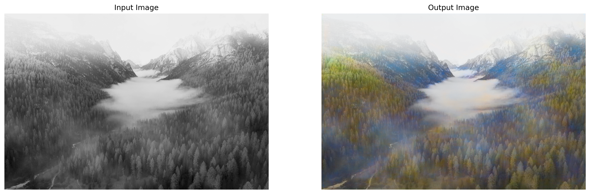

<div align="center">
    <h1>Grayscale2Color Landscape from scratch🌄 </h1>
</div>

<div align="center" style="line-height: 1;">
    <nav class="badge-container">
        <a href="https://huggingface.co/docs/hub" target="_blank" rel="noopener noreferrer">
            
        </a>
        <a href="https://pypi.org/project/pillow/" target="_blank" rel="noopener noreferrer">
            
        </a>
        <a href="https://numpy.org/" target="_blank" rel="noopener noreferrer">
            
        </a>
        <a href="https://www.tensorflow.org/" target="_blank" rel="noopener noreferrer">
            
        </a>
        <a href="https://gradio.app/" target="_blank" rel="noopener noreferrer">
            
        </a>
        <a href="https://opensource.org/licenses/MIT" target="_blank" rel="noopener noreferrer">
            
        </a>
    </nav>
</div>

## Introduction
Transform grayscale landscape images into vibrant, full-color visuals with this autoencoder model. Built from scratch, this project leverages deep learning to predict color channels (a*b* in L*a*b* color space) from grayscale inputs, delivering impressive results with a sleek, minimalist design. 🌄

## Key Features
- 📸 Converts grayscale landscape images to vivid RGB.
- 🧠 Custom autoencoder with spatial attention for enhanced detail.
- ⚡ Optimized for high-quality inference at 512x512 resolution.
- 📊 Achieves a PSNR of 21.70 on the validation set.

## Notebook
Explore the implementation in our Jupyter notebook:  
[](https://colab.research.google.com/github/danhtran2mind/grayscale2color-landscape-from-scratch/blob/main/notebooks/autoencoder-grayscale-to-color-landscape.ipynb)
[](https://studiolab.sagemaker.aws/import/github/danhtran2mind/grayscale2color-landscape-from-scratch/blob/main/notebooks/autoencoder-grayscale-to-color-landscape.ipynb)
[](https://deepnote.com/launch?url=https://github.com/danhtran2mind/grayscale2color-landscape-from-scratch/blob/main/notebooks/autoencoder-grayscale-to-color-landscape.ipynb)
[](https://mybinder.org/v2/gh/danhtran2mind/grayscale2color-landscape-from-scratch/main?filepath=autoencoder-grayscale-to-color-landscape.ipynb)
[](https://github.com/danhtran2mind/grayscale2color-landscape-from-scratch/blob/main/notebooks/autoencoder-grayscale-to-color-landscape.ipynb)

## Dataset
Details about the dataset are available in the [README Dataset](./dataset/README.md). 📂

## From Scratch Model
Custom-built autoencoder with a spatial attention mechanism, trained **FROM SCRATCH** to predict a*b* color channels from grayscale (L*) inputs. 🧩

## Demonstration
Experience the brilliance of our cutting-edge technology! Transform grayscale landscapes into vibrant colors with our interactive demo.

[](https://huggingface.co/spaces/danhtran2mind/autoencoder-grayscale2color-landscape)


## Installation

### Step 1: Clone the Repository
```bash
git clone https://github.com/danhtran2mind/grayscale2color-landscape-from-scratch
cd grayscale2color-landscape-from-scratch
```

### Step 2: Install Dependencies
```bash
pip install -r requirements.txt
```

## Usage
### Method 1: Using the Gradio App
Run the Gradio application to interact with the model via a web interface.

```python
python app.py
```

This launches a local server at `localhost:7860`, where you can upload grayscale images and view colorized results.

### Method 2: Using Python Code
Follow these steps to colorize images programmatically using Python.

#### 1. Import Required Libraries
Install and import the necessary libraries for image processing and model inference.

```python
from PIL import Image
import os
import numpy as np
import tensorflow as tf
import requests
import matplotlib.pyplot as plt
from skimage.color import lab2rgb
from models.auto_encoder_gray2color import SpatialAttention
```

#### 2. Load the Pre-trained Model
Download and load the autoencoder model from a remote source if it’s not already available locally.

```python
load_model_path = "./ckpts/best_model.h5"
os.makedirs(os.path.dirname(load_model_path), exist_ok=True)

if not os.path.exists(load_model_path):
    url = "https://huggingface.co/danhtran2mind/autoencoder-grayscale2color-landscape/resolve/main/ckpts/best_model.h5"
    print(f"Downloading model from {url}...")
    with requests.get(url, stream=True) as response:
        response.raise_for_status()
        with open(load_model_path, "wb") as f:
            for chunk in response.iter_content(chunk_size=8192):
                f.write(chunk)
    print("Model downloaded successfully.")

print(f"Loading model from {load_model_path}...")
loaded_autoencoder = tf.keras.models.load_model(
    load_model_path, custom_objects={"SpatialAttention": SpatialAttention}
)
print("Model loaded successfully.")
```

#### 3. Define Image Processing Functions
These functions handle image preprocessing, colorization, and visualization.

```python
def process_image(input_img):
    """Convert a grayscale image to color using the autoencoder."""
    # Store original dimensions
    original_width, original_height = input_img.size
    
    # Preprocess: Convert to grayscale, resize, and normalize
    img = input_img.convert("L").resize((512, 512))
    img_array = tf.keras.preprocessing.image.img_to_array(img) / 255.0
    img_array = img_array[None, ..., 0:1]  # Add batch dimension

    # Predict color channels
    output_array = loaded_autoencoder.predict(img_array)
    
    # Reconstruct LAB image
    L_channel = img_array[0, :, :, 0] * 100.0  # Scale L channel
    ab_channels = output_array[0] * 128.0      # Scale ab channels
    lab_image = np.stack([L_channel, ab_channels[:, :, 0], ab_channels[:, :, 1]], axis=-1)
    
    # Convert to RGB and clip values
    rgb_array = lab2rgb(lab_image)
    rgb_array = np.clip(rgb_array, 0, 1) * 255.0
    
    # Create and resize output image
    rgb_image = Image.fromarray(rgb_array.astype(np.uint8), mode="RGB")
    return rgb_image.resize((original_width, original_height), Image.Resampling.LANCZOS)

def process_and_save_image(image_path):
    """Process an image and save the colorized result."""
    input_img = Image.open(image_path)
    output_img = process_image(input_img)
    output_img.save("output.jpg")
    return input_img, output_img

def plot_images(input_img, output_img):
    """Display input and output images side by side."""
    plt.figure(figsize=(17, 8), dpi=300)
    
    # Plot input grayscale image
    plt.subplot(1, 2, 1)
    plt.imshow(input_img, cmap="gray")
    plt.title("Input Grayscale Image")
    plt.axis("off")
    
    # Plot output colorized image
    plt.subplot(1, 2, 2)
    plt.imshow(output_img)
    plt.title("Colorized Output Image")
    plt.axis("off")
    
    # Save and display the plot
    plt.savefig("output.jpg", dpi=300, bbox_inches="tight")
    plt.show()
```

#### 4. Perform Inference
Run the colorization process on a sample image.

```python
# Set image dimensions and path
WIDTH, HEIGHT = 512, 512
image_path = "<path_to_input_image.jpg>"  # Replace with your image path

# Process and visualize the image
input_img, output_img = process_and_save_image(image_path)
plot_images(input_img, output_img)
```

#### 5. Example Output
The output will be a side-by-side comparison of the input grayscale image and the colorized result, saved as `output.jpg`. For a sample result, see the example below:


## Training Hyperparameters
- **Resolution**: 
    - AutoEncoder: 512x512 pixels
    - Transformer: 1024x1024 pixels
    - U-net: 1024x1024 pixels

- **Color Space**: L*a*b*
- **Custom Layer**: SpatialAttention
- **Model File**: `best_model.h5`
    - AutoEncoder: `ckpts/autoencoder/autoencoder_colorization_model.h5`
    - Transformer: `ckpts/transformer/transformer_colorization_model.h5`
    - U-net: `ckpts/unet/unet_colorization_model.h5`
- **Epochs**: 100

## Callbacks
- **Early Stopping**: Monitors `val_loss`, patience of 20 epochs, restores best weights.
- **ReduceLROnPlateau**: Monitors `val_loss`, reduces learning rate by 50% after 5 epochs, minimum learning rate of 1e-6.
- **BackupAndRestore**: Saves checkpoints to:
    - AutoEncoder: `ckpts/autoencoder/backup`
    - Transformer: `ckpts/transformer/backup`
    - U-net: `ckpts/unet/backup`
  
## Metrics
**PSNR (Validation)**
| Models | PSNR ↑| 
|-------------|-------| 
| AutoEncoder | 21.70 dB | 
| Transformer | **26.81 dB** | 
| U-net | 26.55 dB |
## Environment
- Python v3.11.11
- Libraies
    ```bash
    numpy==1.26.4
    tensorflow==2.18.0
    opencv-python==4.11.0.86
    scikit-image==0.25.2
    matplotlib==3.7.2
    scikit-image==0.25.2
    ```

## Contact
For questions or issues, reach out via the [GitHub Issues](https://github.com/danhtran2mind/grayscale2color-landscape-from-scratch/issues) tab. 🚀
